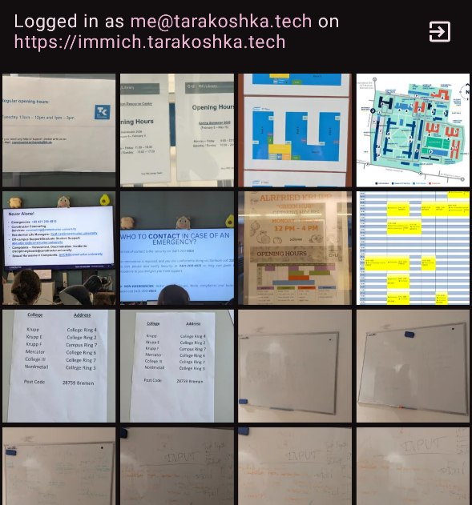
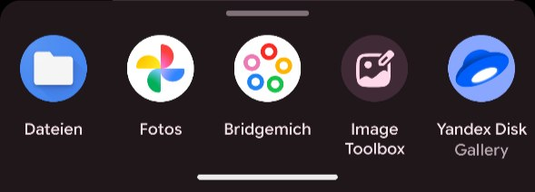

# Bridgemich
**An image picker for [Immich](https://immich.app/).**

---

Allows you to use Immich when choosing photos in apps, similar to a gallery app.  
Only displays images which are backed up.  
Without this you have to download photo on Immich and then search for it again.

---

### Downloads
> [Download latest APK](https://fj.tarakoshka.tech/tarakoshka/bridgemich/releases/download/latest/app-release.apk) from Forgejo  
> Android 7.0+  

